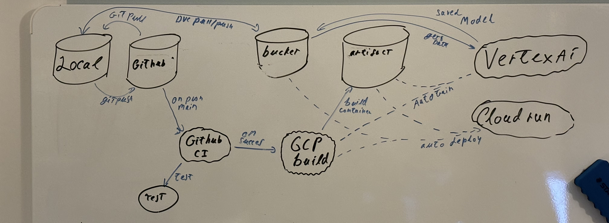

# Exam template for 02476 Machine Learning Operations


This is the report template for the exam. Please only remove the text formatted as with three dashes in front and behind
like:


```--- question 1 fill here ---```


where you instead should add your answers. Any other changes may have unwanted consequences when your report is auto
generated in the end of the course. For questions where you are asked to include images, start by adding the image to
the `figures` subfolder (please only use `.png`, `.jpg` or `.jpeg`) and then add the following code in your answer:


```markdown

```


In addition to this markdown file, we also provide the `report.py` script that provides two utility functions:


Running:


```bash
python report.py html
```


will generate an `.html` page of your report. After deadline for answering this template, we will autoscrape
everything in this `reports` folder and then use this utility to generate an `.html` page that will be your serve
as your final handin.


Running


```bash
python report.py check
```


will check your answers in this template against the constrains listed for each question e.g. is your answer too
short, too long, have you included an image when asked to.


For both functions to work it is important that you do not rename anything. The script have two dependencies that can
be installed with `pip install click markdown`.


## Overall project checklist


The checklist is *exhaustic* which means that it includes everything that you could possible do on the project in
relation the curricilum in this course. Therefore, we do not expect at all that you have checked of all boxes at the
end of the project.


### Week 1


* [x] Create a git repository
* [x] Make sure that all team members have write access to the github repository
* [x] Create a dedicated environment for you project to keep track of your packages
* [x] Create the initial file structure using cookiecutter
* [x] Fill out the `make_dataset.py` file such that it downloads whatever data you need and
* [x] Add a model file and a training script and get that running
* [x] Remember to fill out the `requirements.txt` file with whatever dependencies that you are using
* [ ] Remember to comply with good coding practices (`pep8`) while doing the project
* [x] Do a bit of code typing and remember to document essential parts of your code
* [x] Setup version control for your data or part of your data
* [x] Construct one or multiple docker files for your code
* [x] Build the docker files locally and make sure they work as intended
* [x] Write one or multiple configurations files for your experiments
* [x] Used Hydra to load the configurations and manage your hyperparameters
* [x] When you have something that works somewhat, remember at some point to to some profiling and see if
     you can optimize your code
* [x] Use Weights & Biases to log training progress and other important metrics/artifacts in your code. Additionally,
     consider running a hyperparameter optimization sweep.
* [x] Use Pytorch-lightning (if applicable) to reduce the amount of boilerplate in your code


### Week 2


* [x] Write unit tests related to the data part of your code
* [x] Write unit tests related to model construction and or model training
* [x] Calculate the coverage.
* [x] Get some continuous integration running on the github repository
* [x] Create a data storage in GCP Bucket for you data and preferable link this with your data version control setup
* [x] Create a trigger workflow for automatically building your docker images
* [x] Get your model training in GCP using either the Engine or Vertex AI
* [x] Create a FastAPI application that can do inference using your model
* [ ] If applicable, consider deploying the model locally using torchserve
* [x] Deploy your model in GCP using either Functions or Run as the backend


### Week 3


* [x] Check how robust your model is towards data drifting
* [ ] Setup monitoring for the system telemetry of your deployed model
* [ ] Setup monitoring for the performance of your deployed model
* [ ] If applicable, play around with distributed data loading
* [ ] If applicable, play around with distributed model training
* [x] Play around with quantization, compilation and pruning for you trained models to increase inference speed


### Additional


* [x] Revisit your initial project description. Did the project turn out as you wanted?
* [x] Make sure all group members have a understanding about all parts of the project
* [x] Uploaded all your code to github


## Group information


### Question 1
> **Enter the group number you signed up on <learn.inside.dtu.dk>**
>
> Answer:


70


### Question 2
> **Enter the study number for each member in the group**
>
> Example:
>
> *sXXXXXX, sXXXXXX, sXXXXXX*
>
> Answer:


183546, s201968, s201030, s204159


### Question 3
> **What framework did you choose to work with and did it help you complete the project?**
>
> Answer length: 100-200 words.
>
> Example:
> *We used the third-party framework ... in our project. We used functionality ... and functionality ... from the*
> *package to do ... and ... in our project*.
>
> Answer:


We used the third-party framework TorchDrift to simulate and monitor drift in our data.
We have implemented it as follows. First we train a data drift model using a MMD kernel using the output of the convolution layers as the feature.
We have only implemented it locally as we did not have time to implement it on the server. If we wanted to implement it on the serve we would run it before we made inference to make sure that the data we try to predict is within the distribution.
We found that there is a significant difference in the latent space when analyzing a model of a fish from our test set vs an image of us which is out of distribution.


## Coding environment


> In the following section we are interested in learning more about you local development environment.


### Question 4


> **Explain how you managed dependencies in your project? Explain the process a new team member would have to go**
> **through to get an exact copy of your environment.**
>
> Answer length: 100-200 words
>
> Example:
> *We used ... for managing our dependencies. The list of dependencies was auto-generated using ... . To get a*
> *complete copy of our development environment, one would have to run the following commands*
>
> Answer:
We divided the dependencies into a requirements.txt, which contained the runtime dependencies (both for prediction and training), and a requirements_dev.txt, which contained tools which were only used for development. A new team member would have to install the conda package manager. Then they would have to run the three ‘make’ tools; create_environment, activate_environment and dev_requirements, in the given order, to create an environment with the correct python version and install all development and runtime dependencies. We generally kept the runtime requirements up to date by using the pipreqs tool. When building containers, only the requirements.txt was used. That concludes the question.


### Question 5


> **We expect that you initialized your project using the cookiecutter template. Explain the overall structure of your**
> **code. Did you fill out every folder or only a subset?**
>
> Answer length: 100-200 words
>
> Example:
> *From the cookiecutter template we have filled out the ... , ... and ... folder. We have removed the ... folder*
> *because we did not use any ... in our project. We have added an ... folder that contains ... for running our*
> *experiments.*
> Answer:


We used the mlops_template from nicki https://github.com/SkafteNicki/mlops_template. 
The folders and their functions are described below:
Data: for storing data
dockerfiles: for storing our dockerfiles
docs: we did not use the docs folder as we had no time to fill it out
models: Used for storing model checkpoints
notebooks: used to store notebooks for pytorch profile, and data drift
tests: for storing python tests
reports: for storing this documents
requirements.txt: for storing all used packages we had separate files for testing and deploying
FishEye: used to store our python module. In this we had folders for modules for data, models architecture, and training.


### Question 6


> **Did you implement any rules for code quality and format? Additionally, explain with your own words why these**
> **concepts matters in larger projects.**
>
> Answer length: 50-100 words.
>
> Answer:
We used ruff to format our code and organize our imports so the project was more aligned with the pep8 standard. We used typing to be able to catch unexpected input types early. Lastly we used the cookiecutter based template designed for this course.
When working in larger projects with multiple people, it is good to keep a consistent way for writing and structuring code as it will make it easier for all team members to quickly understand the code made by other team members. 


## Version control


> In the following section we are interested in how version control was used in your project during development to
> corporate and increase the quality of your code.


### Question 7


> **How many tests did you implement and what are they testing in your code?**
>
> Answer length: 50-100 words.
>
> Example:
> *In total we have implemented X tests. Primarily we are testing ... and ... as these the most critical parts of our*
> *application but also ... .*
>
> Answer:
We made two tests for the data. The first one tests that our make_data.py file works as expected and returns the correct number of images and labels in the correct dimensions.
The second data test tests that the data module has made the correct train/val/test split, that each image element has the correct dimension and type.
We have a model test that ensures that a forward pass through the model returns the expected dimensions.
Lastly, we have a train test that makes sure the train loop can perform a single epoch without crashing.


### Question 8


> **What is the total code coverage (in percentage) of your code? If you code had an code coverage of 100% (or close**
> **to), would you still trust it to be error free? Explain you reasoning.**
>
> Answer length: 100-200 words.
>
> Example:
> *The total code coverage of code is X%, which includes all our source code. We are far from 100% coverage of our **
> *code and even if we were then...*
>
> Answer:
We currently maintain an overall code coverage of 80% for the code within our "src" project folder. This percentage is notably impacted by the absence of tests for the "predict_model.py" file, resulting in a 0% coverage for this particular module. However, when considering the files that undergo testing, we achieve an impressive code coverage ranging between 95% and 100%. It is important to note that the uncovered lines typically exist below the "if name == "main":" line, which does not significantly contribute to the core functionality of the code. 
Despite the high code coverage, it is crucial to recognize that this metric does not guarantee flawless and error-free code. While most lines in the tested files are executed, the testing primarily focuses on specific features. Therefore, the functionality of the code is only thoroughly examined for particular scenarios. 


### Question 9


> **Did you workflow include using branches and pull requests? If yes, explain how. If not, explain how branches and**
> **pull request can help improve version control.**
>
> Answer length: 100-200 words.
>
> Example:
> *We made use of both branches and PRs in our project. In our group, each member had an branch that they worked on in*
> *addition to the main branch. To merge code we ...*
>
> Answer:
In addition to our primary development branch, we employed a separate branch for the development of unit tests. This helped us ensure a systematic and focused approach to verifying the effectiveness of new tests before merging them into the main branch, contributing to a more robust and stable codebase.
We did not find the need to use individual branches for the team members in the group as we mostly worked with a mob-programming style approach on the main branch. The use of branches though would be helpful for integrating isolated features for larger projects where we had split up the work a bit more than we did in this project. 
### Question 10


> **Did you use DVC for managing data in your project? If yes, then how did it improve your project to have version**
> **control of your data. If no, explain a case where it would be beneficial to have version control of your data.**
>
> Answer length: 100-200 words.
>
> Example:
> *We did make use of DVC in the following way: ... . In the end it helped us in ... for controlling ... part of our*
> *pipeline*
>
> Answer:


Yes we used DVC together with Google Cloud bucket. We only had 2 versions of our data throughout our process. Which means that we did not use the features to much. 
It could be really useful if we had manually pre-processed the training images before training. Then DVC would allow us to save all versions of the pre-processed data together with the code from git that produced the data.
However we used it to store different versions of our trained model. This allowed us to go back in time and deploy the most optimal model to google cloud run and our web app.


### Question 11


> **Discuss you continues integration setup. What kind of CI are you running (unittesting, linting, etc.)? Do you test**
> **multiple operating systems, python version etc. Do you make use of caching? Feel free to insert a link to one of**
> **your github actions workflow.**
>
> Answer length: 200-300 words.
>
> Example:
> *We have organized our CI into 3 separate files: one for doing ..., one for running ... testing and one for running*
> *... . In particular for our ..., we used ... .An example of a triggered workflow can be seen here: <weblink>*
>
> Answer:
We used GitHub Actions to execute unit tests automatically with each push operation to the main branch, serving as a crucial safety protocol to catch potential issues before code changes were pushed to the remote repository. The GitHub workflow was asbjørn specifically configured to run on a Linux Ubuntu version similar akin to the environment used for our Docker images in production. Given that both our primary development environment and our deployment environment were based on Ubuntu, we focused solely on ensuring compatibility with Linux and didn't concern ourselves with unfortunate operating systems like macOS or Windows.
During the course of development, we encountered problems with authenticating DVC (Data Version Control) for our Google Cloud Storage (GCS) bucket. However, we successfully resolved this by leveraging a GitHub workflow authentication tool provided by Google. This solution streamlined the authentication process and ensured seamless integration with our GCS bucket, ensuring efficient and secure data version control within our development and deployment workflows. The continuous integration setup, aligned with our development environment, contributed to a robust and reliable development pipeline, enhancing code quality and deployment reliability. In the process of trying to authenticate the workflow, we accidentally leaked a service key stored in a repository secret and we therefore had to terminate the credentials key.


## Running code and tracking experiments


> In the following section we are interested in learning more about the experimental setup for running your code and
> especially the reproducibility of your experiments.


### Question 12


> **How did you configure experiments? Did you make use of config files? Explain with coding examples of how you would**
> **run a experiment.**
>
> Answer length: 50-100 words.
>
> Example:
> *We used a simple argparser, that worked in the following way: python my_script.py --lr 1e-3 --batch_size 25*
>
> Answer:
To make the experiments reproducible we used make files to allow easy starting of training. 
We then used Hydra files to configure each experiment setup.
And we used Weights and Biases to store the performance and configurations together in the cloud.
So to run an experiment we would run
`make train` 
And then in the config file change some parameters.


### Question 13


> **Reproducibility of experiments are important. Related to the last question, how did you secure that no information**
> **is lost when running experiments and that your experiments are reproducible?**
>
> Answer length: 100-200 words.
>
> Example:
> *We made use of config files. Whenever an experiment is run the following happens: ... . To reproduce an experiment*
> *one would have to do ...*
>
> Answer:


To make a new experiment we start by creating a new config file. The config file is then loaded in with hydra and logged to weights and biases. Which allows us to view the exact configuration of the experiment. We also log the exact git commit that was used to train. Which allows us to get the exact code. This also stores the DVC commit to use the same data.
This allows us to reproduce each experiment by reverting the code using the git commit tag. Then pulling the correct data with DVC and running using the `make train` command with the config file that is stored in Weights and biases. 


### Question 14


> **Upload 1 to 3 screenshots that show the experiments that you have done in W&B (or another experiment tracking**
> **service of your choice). This may include loss graphs, logged images, hyperparameter sweeps etc. You can take**
> **inspiration from [this figure](figures/wandb.png). Explain what metrics you are tracking and why they are**
> **important.**
>
> Answer length: 200-300 words + 1 to 3 screenshots.
>
> Example:
> *As seen in the first image when have tracked ... and ... which both inform us about ... in our experiments.*
> *As seen in the second image we are also tracking ... and ...*
>
> Answer:
The following images shows a run of our training on google vertex ai.
We start by logging a batch of the augmented images to weight and biases to visually confirm that our data processing works as intended. This allows us to confirm that any issues with the training is not from the data pipeline.
We can see that the images have been augmented by rotation, flipping and scaling. The images have then been padded to fit within the original image dimensions. We did also try other augmentations but they did not improve performance.
We then log all of the configuration of the model using the configs from hydra and uploaded with weights and biases.
During the training we log both train loss, train accuracy, val loss, val accuracy, test loss, and test accuracy. The graphs can be seen in the attached screenshot.
From this we can see that the train loss and val loss follows each other. This is a good indication that the model is not overfitting. We can see that they start with a heavy slope and then flattens out indicating model convergence.
From the final performance the model gets an acc of 83 procent. Which is ok but not that good


### Question 15


> **Docker is an important tool for creating containerized applications. Explain how you used docker in your**
> **experiments? Include how you would run your docker images and include a link to one of your docker files.**
>
> Answer length: 100-200 words.
>
> Example:
> *For our project we developed several images: one for training, inference and deployment. For example to run the*
> *training docker image: `docker run trainer:latest lr=1e-3 batch_size=64`. Link to docker file: <weblink>*
>
> Answer:


We used docker to easily manage the environment when training and deploying to the google cloud.
For the training docker we used this docker file https://github.com/christian-kento-rasmussen/02476-ML-Ops/blob/main/dockerfiles/train_model.dockerfile. It contains the python module and all files needed to run the training loop but not the data. The data is accessed directly from the bucket to reduce docker container size.
We did also use a docker container for deployment. We chose to upload the model directly to the container as we had problems with accessing the checkpoint from google cloud bucket in google run. 
The docker file for deployment can be found here https://github.com/christian-kento-rasmussen/02476-ML-Ops/blob/main/dockerfiles/train_model.dockerfile 


### Question 16


> **When running into bugs while trying to run your experiments, how did you perform debugging? Additionally, did you**
> **try to profile your code or do you think it is already perfect?**
>
> Answer length: 100-200 words.
>
> Example:
> *Debugging method was dependent on group member. Some just used ... and others used ... . We did a single profiling*
> *run of our main code at some point that showed ...*
>
> Answer:
When we found bugs in our code. We started by reading the error message to try and understand the error. If that did not work we moved on to using print statements feks when the dimensions did not work. If the issues was more involved we used the build in debug mode in vs code. 
As for profiling we used both the c profiler and pytorch profiling with tensorboard. We found the c profiler to be easy ish to understand but only for simple tasks not to debug model performance. 
The pytorch profiler was a bit better as it gave an easy to understand overview over the models performance.


## Working in the cloud


> In the following section we would like to know more about your experience when developing in the cloud.


### Question 17


> **List all the GCP services that you made use of in your project and shortly explain what each service does?**
>
> Answer length: 50-200 words.
>
> Example:
> *We used the following two services: Engine and Bucket. Engine is used for... and Bucket is used for...*
>
> Answer:
The servies and what they do are listed below:
Bucket: Used to store files. We used it to store our training data and trained models using DVC. 
Vertex AI: We used it to train our model by uploading a docker image. We found it nice that the bucket was connected to the docker by default. 
Artifacts: We used Artifacts to store the docker images
Cloud run: We used it to host our inference model and its front end website


### Question 18


> **The backbone of GCP is the Compute engine. Explained how you made use of this service and what type of VMs**
> **you used?**
>
> Answer length: 100-200 words.
>
> Example:
> *We used the compute engine to run our ... . We used instances with the following hardware: ... and we started the*
> *using a custom container: ...*
>
> Answer:
Starting off we used the compute engine together with our docker container for training to actually train our model on the cloud. For this we used an E2 1-2 vCPU instance, featuring 1 shared core, hosted in the Belgium region. One issue with this however, was that we did not find a smart way to access the data from our gcp bucket and thus had to copy our data to the docker container. 
We therefore rather quickly turned to the use of the Vertex AI service instead as we found this easier to use for integrating the training script with the google cloud bucket that our data was stored in. 


--- question 18 fill here ---


### Question 19


> **Insert 1-2 images of your GCP bucket, such that we can see what data you have stored in it.**
> **You can take inspiration from [this figure](figures/bucket.png).**
>
> Answer:
Our bucket is structured as follows:
data/ : contains data folder from DVC with version history.
inside this folder we have:
processed/ : the processed data that we use to train the model with before we apply augmentations.
raw/ : Raw contains the raw data
files/ : contains DVC files that does not keep version history
models/ : models contains the trained model checkpoints from pytorch lightning.


We have included data protection on the bucket. Which means that all users needs to be authenticated to access its contents. This gave a few difficulties as we tried to set DVC up with google cloud bucket when deployed to github actions.


### Question 20


> **Upload one image of your GCP container registry, such that we can see the different images that you have stored.**
> **You can take inspiration from [this figure](figures/registry.png).**
>
> Answer:
We used the artifact container to store both the containers for training and deployment. 


### Question 21


> **Upload one image of your GCP cloud build history, so we can see the history of the images that have been build in**
> **your project. You can take inspiration from [this figure](figures/build.png).**
>
> Answer:


We used the artifact container to store both the containers for training and deployment.


### Question 22


> **Did you manage to deploy your model, either in locally or cloud? If not, describe why. If yes, describe how and**
> **preferably how you invoke your deployed service?**
>
> Answer length: 100-200 words.
>
> Example:
> *For deployment we wrapped our model into application using ... . We first tried locally serving the model, which*
> *worked. Afterwards we deployed it in the cloud, using ... . To invoke the service an user would call*
> *`curl -X POST -F "file=@file.json"<weburl>`*
>
> Answer:


Yes, we managed to deploy our model in the cloud using the cloud run service on google cloud platform, which helped us deploy the model to the cloud. For this we made a docker container specifically for running our FastAPI. We wrapped our application in a simple html, css, javascript interface using the mount functionality of FastAPI. The user can therefore interact with our app through our url: {INSERT}, as it is hosted on the world wide web. We chose in this project to not work with local deployment but rather moved straight to the cloud deployment as we were more interested in getting the application running live. 
### Question 23


> **Did you manage to implement monitoring of your deployed model? If yes, explain how it works. If not, explain how**
> **monitoring would help the longevity of your application.**
>
> Answer length: 100-200 words.
>
> Example:
> *We did not manage to implement monitoring. We would like to have monitoring implemented such that over time we could*
> *measure ... and ... that would inform us about this ... behaviour of our application.*
>
> Answer:
We did not manage to implement monitoring. We would like to have monitoring implemented such that over time we could monitor the distribution of the predictions made by our model. This could be useful for finding potential issues with the model as well as getting insights about how the product is being used in production.
We would also have liked to monitor the traffic level as well as the inference speed in order to ensure the system performance is kept persistent and that the demand for the service justifies the continuous effort to keep the system running and up to date.
### Question 24


> **How many credits did you end up using during the project and what service was most expensive?**
>
> Answer length: 25-100 words.
>
> Example:
> *Group member 1 used ..., Group member 2 used ..., in total ... credits was spend during development. The service*
> *costing the most was ... due to ...*
>
> Answer:
We ended up using ?? credits in total on cloud services. The reason for this number being rather low was both a large part of our testing phase being done locally and our proficiency in pausing/stopping unused services when possible. Additionally, we predominantly adopted a mob programming approach, as described in other questions, facilitating interaction with the cloud services through just one account for the majority of the time. 


## Overall discussion of project


> In the following section we would like you to think about the general structure of your project.


### Question 25


> **Include a figure that describes the overall architecture of your system and what services that you make use of.**
> **You can take inspiration from [this figure](figures/overview.png). Additionally in your own words, explain the**
> **overall steps in figure.**
>
> Answer length: 200-400 words
>
> Example:
>
> *The starting point of the diagram is our local setup, where we integrated ... and ... and ... into our code.*
> *Whenever we commit code and puch to github, it auto triggers ... and ... . From there the diagram shows ...*
>
> Answer:
We developed the code locally and connected to our google cloud bucket with DVC to version control the data. When pushing to the main branch, gihub would run our unit tests to see if the tested parts still work. We had set up a trigger in gcp to build the training container docker image. We also used our trainer image to run the training process with vertex AI. We also manually built a prediction app image with fastAPI. The predict container was then deployed with cloud run and served to the world wide web. A small web project including the common index.html, style.css and script.js were also served from the container to serve an interactive webapp. As such, both frontend and backend was served from the container. The dotted lines in the figure indicate some of the flows that we did not manage to automate in time. We would have liked to automate the building of the predict image, as well as the training process and the deployment of the best model. We would especially have liked to build an image for prediction that can load in the ‘deployment’ version of the model without needing to be rebuilt (or maybe only have the last layer rebuilt) unless the architecture is changed.


### Question 26


> **Discuss the overall struggles of the project. Where did you spend most time and what did you do to overcome these**
> **challenges?**
>
> Answer length: 200-400 words.
>
> Example:
> *The biggest challenges in the project was using ... tool to do ... . The reason for this was ...*
>
> Answer:
One of our biggest struggles was related to the credentials in google cloud. We had some issues with pushing to dvc because of an issue where dvc would not use the correct credential regardless of being logged into the correct account with gcloud auth. In the end, we found a solution where we created a new service account and generated a credentials file. We then authenticated the service account to use the storage bucket. A similar issue showed up with the github pipeline where we had some struggles with passing the credentials from a github secret to the testing environment. We also had some similar struggles with credentials for a VM in the project that was not authenticated to pull an image from the artifact registry.
Another struggle we encountered throughout the project was related to the use of configuration files and hydra. We had to spend quite some time on figuring out path relations when passing on parameters through the hydra decorator to functions. This issue had us running two training scripts for the majority of the project with the outer one having a hydra decorator located in the project folder calling the train function in an inner script located in the source folder. Eventually we figured out a solution for this leading to a more clean file structure.
As a last struggle, we had some talks in the group on the trade-off between potentially parallelizing various tasks versus doing everything together. We agreed on using the mob programming approach as we all wanted to be part of all aspects of the ML pipeline and learn about as many of the presented tools as possible. This choice possibly traded the development of some extra cool features for the common group understanding of the entire project, which we deemed more important in this project. 
### Question 27


> **State the individual contributions of each team member. This is required information from DTU, because we need to**
> **make sure all members contributed actively to the project**
>
> Answer length: 50-200 words.
>
> Example:
> *Student sXXXXXX was in charge of developing of setting up the initial cookie cutter project and developing of the*
> *docker containers for training our applications.*
> *Student sXXXXXX was in charge of training our models in the cloud and deploying them afterwards.*
> *All members contributed to code by...*
>
> Answer:
For the most part we had a mob-programming approach for this project where we changed roles every 20 minutes. For some of the later stages of the project, we split up on separate development branches with s183546 and s201968 in charge of extending the unit tests, s204159 in charge of model training with wandb and s201030 setting up profiling.


